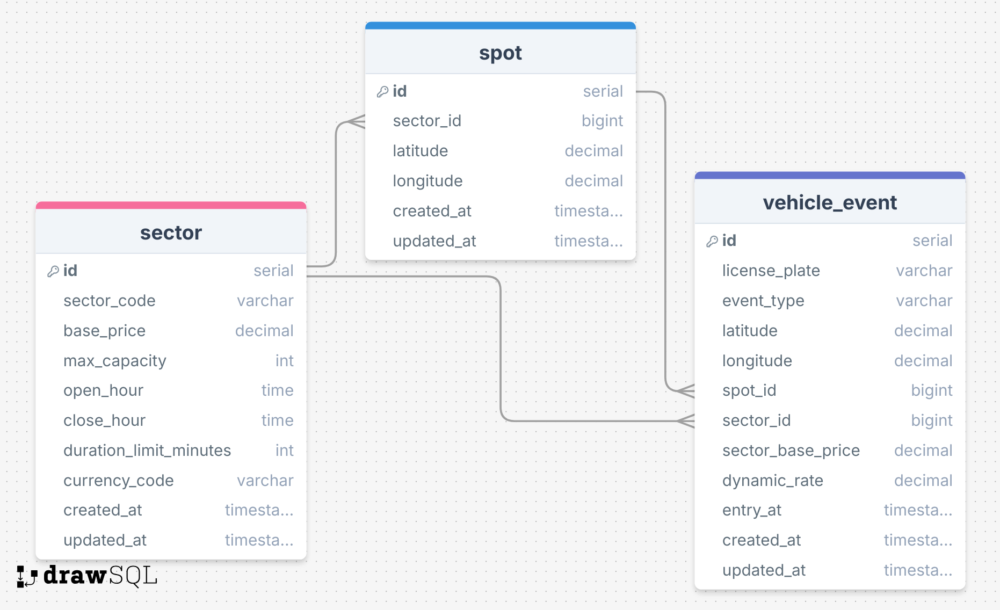

# Parking manager
O objetivo é criar um sistema de gestão de estacionamentos, que controla o número de vagas em aberto,
entrada, saida e faturameto do setor.

## Decisões técnicas
O aplicativo é uma API REST que representa as operações do enunciado.
As collections se encontram nas sessões abaixo devidamente configuradas.

O desenho da solução leva em conta que tem uma garagem e nela tem setores (Sectors) e nesses setores vagas (Spots).
Os eventos (VehiclesEvents) de entrada, estacionamento e saída dos veículos são persistidos. 
São esses eventos que derivam todos os cálculos e controle de estado.  

Ao iniciar o aplicativo, é importante chamar o método /garage para configurar os setores e vagas da garagem.

Sobre a base de código. Foi focado no enunciado do teste para evitar over engineering.
Não foram usadas bibliotecas, como ORM's, na tentativa de manter a simplicidade da solução e mostrar domínio do sistema de banco de dados.

Segue a modelagem do banco de dados:


## Comandos

Na pasta crip, que se envcontr ana raiz do projeto, foram criados comandos para facilitar na subida do ambiente.

```console
chmod +x script/*.sh
```

Iniciar ambiente:
```console
./script/start-dev.sh
```

Parar ambiente:
```console
./script/stop-dev.sh
```

Resetar banco de dados:
```console
./script/reset-database.sh
```
Se isso não funcionar, apague a pasta ./postgres e inicie a aplicação

Testar conexão:
```console
curl http://localhost:3000/garage
```

Logs do PostgreSQL:
```console
docker-compose logs -f postgres
```

Conectar no PostgreSQL:
```console
docker-compose exec postgres psql -U parking_user -d parking_management
```

## Verificação do Ambiente

Health Check do Sistema

PostgreSQL:
```console
docker-compose exec postgres pg_isready
```

Aplicação:
```console
curl http://localhost:3003/actuator/health
```

## Collections
Na pasta collection, localizada na raiz do projeto, existem collections dos programs Bruno e Postman.
Abaixo estão os comandos cURL:

```console
curl --request POST \
  --url http://localhost:3003/api/v1/garage \
  --data '{
  "garage": [
    {
      "sector": "A",
      "basePrice": 10.0,
      "max_capacity": 10,
      "open_hour": "08:00",
      "close_hour": "22:00",
      "duration_limit_minutes": 240
    },
    {
      "sector": "B",
      "basePrice": 4.0,
      "max_capacity": 5,
      "open_hour": "05:00",
      "close_hour": "18:00",
      "duration_limit_minutes": 120
    }
  ],
  "spots": [
    {
      "id": 1,
      "sector": "A",
      "lat": -12.8944,
      "lng": -38.3222
    },
    {
      "id": 2,
      "sector": "A",
      "lat": -12.8956,
      "lng": -38.3198
    },
    {
      "id": 3,
      "sector": "A",
      "lat": -12.8967,
      "lng": -38.3245
    },
    {
      "id": 4,
      "sector": "A",
      "lat": -12.8932,
      "lng": -38.3189
    },
    {
      "id": 5,
      "sector": "A",
      "lat": -12.8978,
      "lng": -38.3267
    },
    {
      "id": 6,
      "sector": "A",
      "lat": -12.8901,
      "lng": -38.3156
    },
    {
      "id": 7,
      "sector": "A",
      "lat": -12.8889,
      "lng": -38.3134
    },
    {
      "id": 8,
      "sector": "A",
      "lat": -12.9012,
      "lng": -38.3289
    },
    {
      "id": 9,
      "sector": "A",
      "lat": -12.8876,
      "lng": -38.3178
    },
    {
      "id": 10,
      "sector": "A",
      "lat": -12.8923,
      "lng": -38.3211
    },
    {
      "id": 11,
      "sector": "B",
      "lat": -12.9015,
      "lng": -38.3345
    },
    {
      "id": 12,
      "sector": "B",
      "lat": -12.9078,
      "lng": -38.3412
    },
    {
      "id": 13,
      "sector": "B",
      "lat": -12.9134,
      "lng": -38.3456
    },
    {
      "id": 14,
      "sector": "B",
      "lat": -12.9089,
      "lng": -38.3389
    },
    {
      "id": 15,
      "sector": "B",
      "lat": -12.9156,
      "lng": -38.3467
    }
  ]
}'
```

```console
curl --request POST \
  --url http://localhost:3003/api/v1/spot-status \
  --data '{
  "lat": -12.8944,
  "lng": -38.3222
}
```

```console
curl --request GET \
  --url http://localhost:3003/api/v1/revenue \
  --data '{
  "date": "2025-06-03",
  "sector": "A"
}
```

```console
curl --request POST \
  --url http://localhost:3003/api/v1/plate-status \
  --data '{
  "license_plate": "ZUL0001"
}
```

```console
curl --request POST \
  --url http://localhost:3003/webhook \
  --data '{
  "license_plate": "ZUL0001",
  "entry_time": "2025-01-01T12:00:00.000Z",
  "event_type": "ENTRY"
}
```

```console
curl --request POST \
  --url http://localhost:3003/webhook \
  --data '{
  "license_plate": "ZUL0001",
  "entry_time": "2025-01-01T12:00:00.000Z",
  "event_type": "ENTRY"
}
```

```console
curl --request POST \
  --url http://localhost:3003/webhook \
  --data '{
  "license_plate": "ZUL0001",
  "lat": -12.8944,
  "lng": -38.3222,
  "event_type": "PARKED"
}
```

```console
curl --request POST \
  --url http://localhost:3003/webhook \
  --data '{    
  "license_plate": "",
  "exit_time": "2025-01-01T12:00:00.000Z",
  "event_type": "EXIT"
}
```
